# Tutorial 9: Flutter Deployment dengan GitHub Actions dan Microsoft App Center

Pemrograman Berbasis Platform (CSGE602022) — diselenggarakan oleh Fakultas Ilmu Komputer Universitas Indonesia, Semester Genap 2023/2024

---

## Tujuan Pembelajaran

Setelah menyelesaikan tutorial ini, mahasiswa diharapkan untuk dapat:

- Memahami konsep _continuous integration_ dan _continuous deployment_.
- Memahami konsep dan penggunaan _GitHub Actions_.
- Memahami konsep dan penggunaan _Microsoft App Center_.
- Menerapkan _continuous integration_ dan _continuous deployment_ pada aplikasi Flutter menggunakan _GitHub Actions_ dan _Microsoft App Center_.
- Menerapkan _GitHub Actions_ untuk melakukan _build_ dan _release_ aplikasi Flutter secara otomatis.

## Pengenalan CI/CD

CI/CD, singkatan dari Continuous Integration dan Continuous Deployment, merupakan konsep penting dalam pengembangan perangkat lunak yang terkait dengan GitHub Actions. Konsep ini memberikan cara untuk mengotomatisasi dan meningkatkan kualitas serta kecepatan dalam pengembangan perangkat lunak.

Continuous Integration (CI) berfokus pada penggabungan (integrasi) perubahan kode secara terus-menerus ke dalam repositori bersama oleh anggota tim. Saat seorang pengembang melakukan perubahan pada kode dan mengirimkannya ke repositori (seperti yang kita lakukan dengan GitHub), sistem CI akan secara otomatis menjalankan serangkaian tes dan verifikasi untuk memastikan bahwa perubahan tersebut tidak merusak atau mengganggu fungsionalitas yang sudah ada. Dengan kata lain, CI membantu mengidentifikasi masalah lebih awal dalam siklus pengembangan.

Continuous Deployment (CD), pada gilirannya, melibatkan otomatisasi untuk merilis (deployment) perubahan kode yang telah melewati proses CI ke lingkungan produksi atau pengujian. Ketika perubahan kode dinyatakan aman setelah melalui serangkaian pengujian CI, CD memungkinkan untuk menyebarkan perubahan tersebut secara otomatis ke server atau lingkungan lainnya tanpa perlu campur tangan manual. Ini membantu mempercepat proses pengembangan dan meningkatkan kecepatan dalam merespons perubahan kebutuhan bisnis.

Ketika kita menggunakan GitHub Actions dalam CI/CD, setiap kali ada perubahan pada repositori, GitHub Actions dapat memicu alur kerja CI untuk menjalankan pengujian dan verifikasi. Jika semuanya berhasil, alur kerja CD dapat diaktifkan untuk merilis perubahan tersebut ke _environment_ produksi atau pengujian.

Dengan menggunakan CI/CD, tim pengembang dapat memastikan bahwa perubahan-perubahan yang dilakukan tidak merusak kualitas atau kinerja aplikasi. Ini juga mempercepat waktu rilis produk dan meningkatkan efisiensi dalam pengelolaan siklus hidup perangkat lunak secara keseluruhan.

## Pengenalan Github Actions

GitHub Actions adalah fitur yang disediakan oleh GitHub untuk memungkinkan otomatisasi dalam siklus pengembangan perangkat lunak. Dengan kata lain, GitHub Actions memungkinkan kita untuk membuat dan menyesuaikan alur kerja otomatis (_workflows_) untuk menjalankan tugas-tugas tertentu setiap kali ada perubahan pada repositori GitHub.

_Workflows_ ini bisa diatur untuk menjalankan berbagai tindakan atau skrip otomatis, seperti melakukan pengujian (_testing_), membangun (_building_) aplikasi, atau merilis (_releasing_) versi baru. Tujuannya adalah untuk membantu tim pengembang mengotomatiskan proses-proses ini, sehingga mereka dapat fokus pada penulisan kode dan pengembangan fitur tanpa harus terlalu khawatir dengan langkah-langkah administratif.

Misalnya, ketika ada perubahan kode di repositori GitHub, GitHub Actions dapat secara otomatis menjalankan alur kerja yang telah Anda tentukan. Alur kerja tersebut dapat mencakup langkah-langkah seperti menguji apakah perubahan tersebut tidak merusak fungsionalitas yang ada, membangun aplikasi yang baru, dan bahkan merilis versi baru jika diperlukan.

Penting untuk dicatat bahwa GitHub Actions memanfaatkan file konfigurasi khusus (biasanya dengan nama `.github/workflows/nama-file.yml`) pada repositori. File ini berisi deskripsi langkah-langkah yang harus dijalankan oleh GitHub Actions.

Dengan GitHub Actions, kolaborasi dalam pengembangan perangkat lunak dapat menjadi lebih efisien karena banyak tugas dapat diotomatisasi. Hal ini memberikan fleksibilitas tambahan kepada pengembang dan tim untuk menyesuaikan alur kerja mereka sesuai kebutuhan proyek.

Berikut adalah contoh _workflow_ sederhana yang dapat kita gunakan untuk membangun dan menguji kode aplikasi berbasis JavaScript dan menggunakan Yarn _package manager_.

```yaml
    name: Build and test

    on:
    push:
        branches:
        - main

    jobs:
    build:
        runs-on: ubuntu-latest
        steps:
        - uses: actions/checkout@v4
        - name: Install dependencies
            run: yarn install
        - name: Build
            run: yarn build

    test:
        runs-on: ubuntu-latest
        steps:
        - uses: actions/checkout@v4
        - uses: actions/setup-node@v4
            with:
            node-version: 16
        - name: Install dependencies
            run: yarn install
        - name: Run tests
            run: yarn test
```

## Pengenalan Microsoft App Center

Microsoft App Center merupakan layanan _cloud_ yang menyediakan berbagai macam fitur untuk memudahkan proses _build_, _test_, _release_, dan _monitoring_ aplikasi. Layanan ini dapat digunakan untuk berbagai macam platform, seperti Android, iOS, Windows, macOS, dan lain-lain. Pada tutorial ini, kita akan menggunakan layanan ini untuk melakukan _build_ dan _release_ aplikasi Flutter secara otomatis.

Microsoft App Center menyediakan banyak sekali fitur keren secara gratis seperti _continuous integration_, _UI testing_, _continuous delivery_, laporan _crash_ dan error dari aplikasi yang ditampilkan secara detail bagaimana log errornya, dan fitur Analytics. Kali ini, kita tidak akan memakai seluruh fitur yang tersedia karena Flutter belum didukung secara resmi oleh App Center. Saat ini, bahasa dan _framework_ yang baru didukung resmi adalah Kotlin, Java, React Native, Xamarin, dan Unity. Pada tutorial kali ini, kita akan fokus ke pembuatan dan perilisan aplikasi pada App Center saja.Untuk lebih jelasnya, kamu dapat membaca [dokumentasi App Center](https://docs.microsoft.com/en-us/appcenter/) secara lebih lanjut.

## Tutorial: Pengaturan Dasar pada App Center

Pada tutorial ini, kamu akan men-_deploy_ aplikasi Flutter yang telah kalian buat pada tutorial-tutorial sebelumnya ke App Center. Berikut ini merupakan tahap awal dalam proses _deployment_ aplikasi.

1. Buatlah akun [App Center](https://appcenter.ms/) menggunakan akun GitHub kamu (tombol paling atas).

    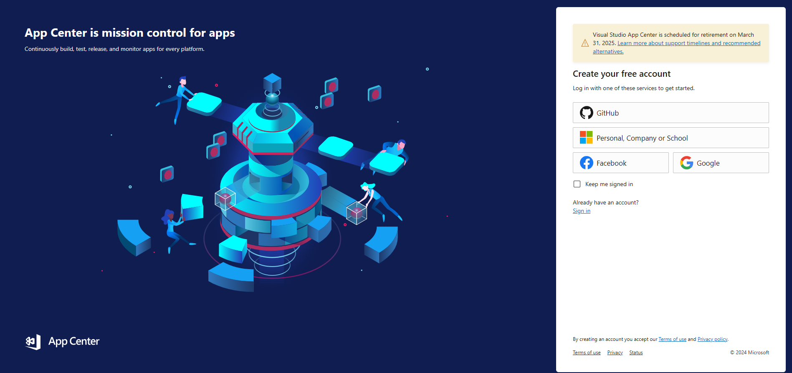

2. Setelah berhasil membuat akun dan _sign in_, buatlah organisasi baru dengan mengakses menu _Add new_ -> _Add new organization_. Isi nama organisasi yang kamu inginkan.

    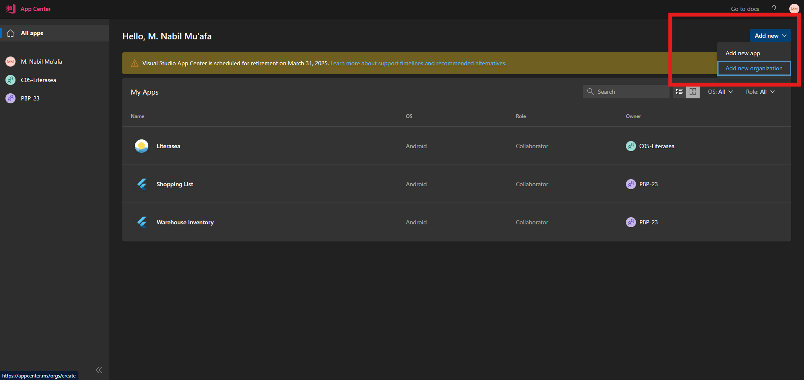

3. Buatlah _slot_ aplikasi baru dengan menekan tombol `Add app`.

    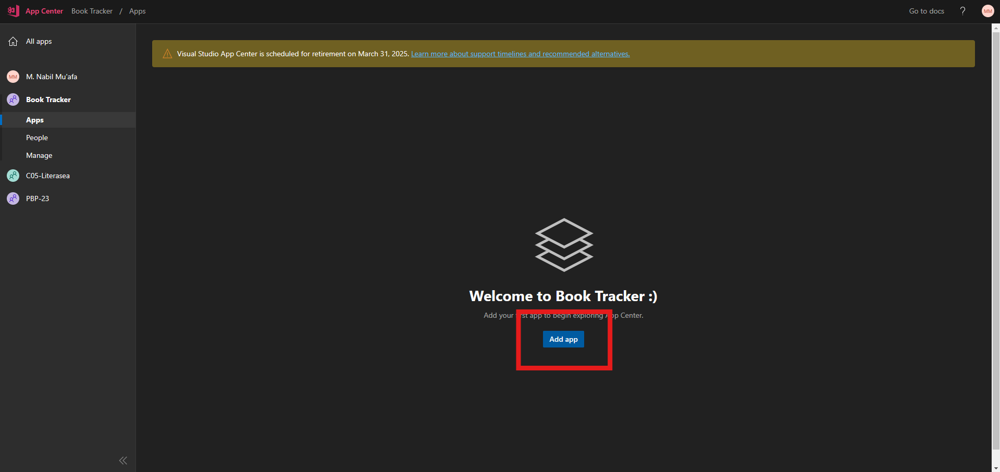

4. Isi nama aplikasi dengan `Book Tracker`. Kamu tidak perlu untuk memilih tipe rilis. Pilih `Android` sebagai OS dan `Java / Kotlin` sebagai platform. Kemudian, klik "Add new app".

    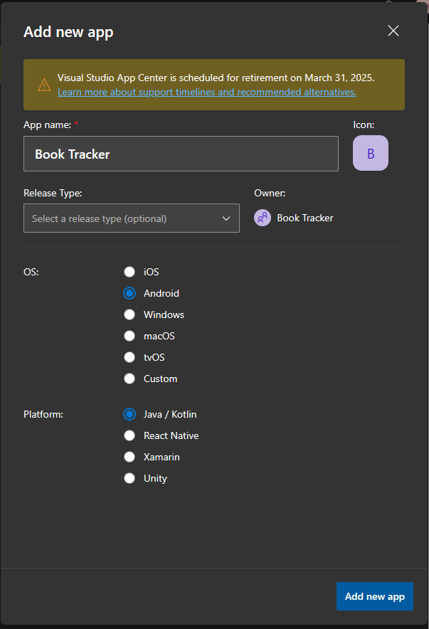

5. Buka menu _Distribute_ dan buka menu _Groups_.

    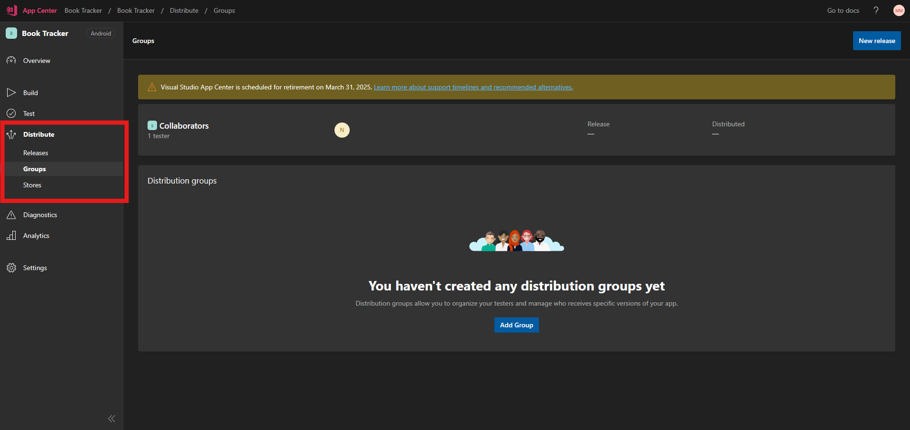

6. Buatlah grup baru dengan menekan tombol "Add Group". Berikan nama `Public` dan berikan akses publik dengan mengubah toggle pada `Allow public access`. Tekan tombol `Create Group` untuk membuat grup baru. Hal ini kita lakukan agar APK yang nantinya dibuat oleh App Center dapat diakses secara publik.

    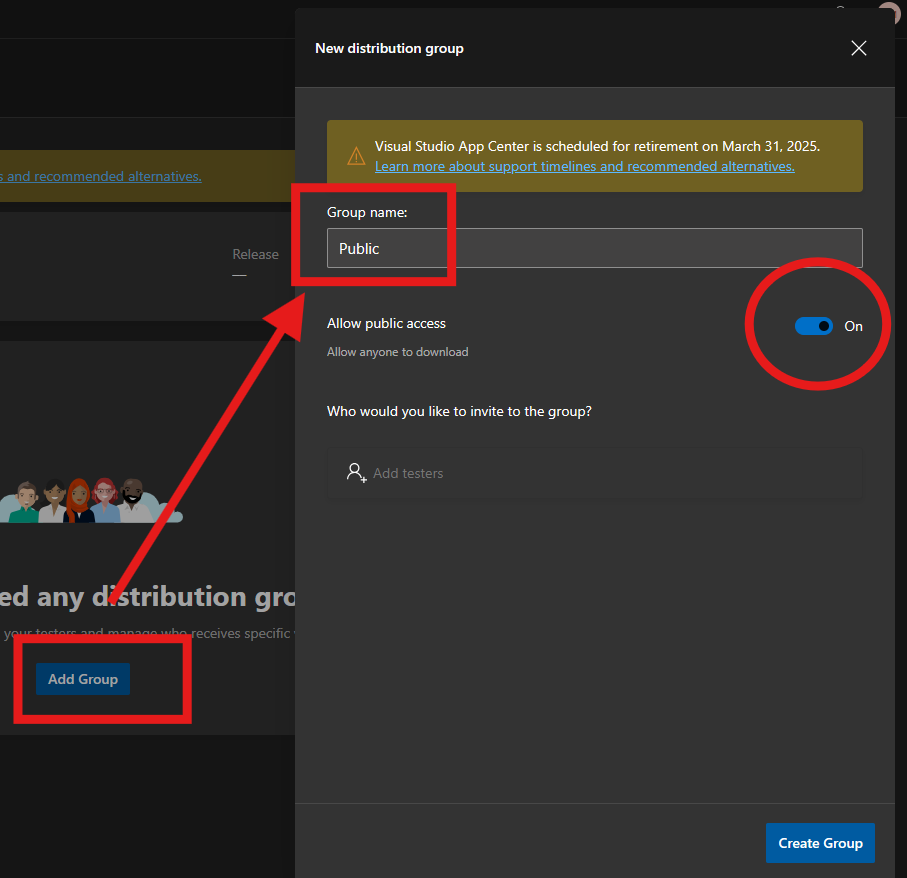

Jika kamu menggunakan organisasi untuk mengorganisasi kode proyekmu, maka ikuti langkah tambahan berikut. Langkah-langkah ini berfungsi untuk memberikan akses repositori kepada App Center pada GitHub.

1. Buka situs [Authorized OAuth Apps](https://github.com/settings/applications) dengan akun yang terdaftar pada organisasi yang memiliki kode proyek.

2. Klik `App Center`.

3. Cari nama organisasi yang memiliki kode proyekmu, lalu klik tombol `Grant` untuk memberikan akses organisasi kepada App Center.

Sampai sini, kamu telah melakukan pengaturan dasar pada App Center. Selanjutnya, kamu akan melakukan pengaturan skrip dan pengesahan (_sign_) pada proyek aplikasi Flutter.

## Tutorial: Pengaturan Dasar Pengesahan Aplikasi Flutter

Untuk publikasi aplikasi pada App Center, aplikasi Flutter harus ditandatangani atau disahkan menggunakan _key_ agar aplikasi yang dirilis dijamin keabsahannya. Oleh karena itu, kita akan membuat _key_ untuk aplikasi dan mengatur automasi agar skrip CI/CD (baik yang ada pada GitHub Actions maupun App Center) dapat berjalan dengan baik.

1. Buatlah sebuah _keystore_.

    Untuk pengguna Mac OS atau Linux, jalankan perintah berikut pada Terminal.

    ```bash
    keytool -genkey -v -keystore ~/release-keystore.jks -keyalg RSA -keysize 2048 -validity 10000 -alias release
    ```

    Untuk pengguna Windows, jalankan perintah berikut pada Command Prompt.

    ```bash
    keytool -genkey -v -keystore %userprofile%\release-keystore.jks -storetype JKS -keyalg RSA -keysize 2048 -validity 10000 -alias release
    ```

    Berikan _keystore_ tersebut _password_ yang aman dan simpan atau ingat-ingat _password_ tersebut, jangan sampai lupa. Isilah informasi yang dibutuhkan hingga proses selesai. Kemudian, **pindahkan berkas tersebut ke dalam _root folder_ proyek aplikasi**.

    Perintah yang telah kamu jalankan berguna untuk menyimpan _keystore file_ dengan nama `release-keystore.jks` di direktori _home_ kamu dengan alias `release`.

    > Apabila Terminal atau Command Prompt tidak mengenali perintah `keytool`, silakan mengikuti panduan tambahan pada bagian _Note_ di [laman web resmi flutter bagian _Create an upload keystore_](https://docs.flutter.dev/deployment/android#create-an-upload-keystore) untuk memasukkan perintah `keytool` ke dalam _environment path_.

2. Tambahkan sintaks berikut pada file `.gitignore` yang ada pada _root folder_ proyek aplikasi agar _keystore_ tidak dihitung masuk sebagai berkas yang ada pada repositori Git. Hal ini dilakukan karena _keystore_ merupakan berkas yang rahasia dan perlu dijaga selayaknya kata sandi sebuah akun.

    ```yaml
    # Remember to never publicly share your keystore.
    # See https://flutter.dev/docs/deployment/android#reference-the-keystore-from-the-app
    *.keystore
    *.jks
    ```

3. Buka berkas `/android/app/build.gradle` dan cari bagian `buildTypes`.

    ```gradle
    buildTypes {
            release {
                // TODO: Add your own signing config for the release build.
                // Signing with the debug keys for now,
                // so `flutter run --release` works.
                signingConfig signingConfigs.debug
            }
    }
    ```

    Ubahlah bagian tersebut menjadi seperti berikut.

    ```gradle
    signingConfigs {
            release {
                    storeFile file("../../release-keystore.jks")
                    storePassword = "$System.env.KEY_PASSWORD"
                    keyAlias = "release"
                    keyPassword = "$System.env.KEY_PASSWORD"
            }
    }
        buildTypes {
            release {
                signingConfig signingConfigs.release
            }
    }
    ```

Sampai sini, kamu sudah melakukan pengaturan dasar untuk pengesahan aplikasi. Selanjutnya, kamu akan melakukan modifikasi skrip GitHub Actions dan pembuatan skrip baru untuk membangun berkas aplikasi pada App Center.

## Tutorial: Pembuatan Skrip GitHub Actions

1. Hasilkan sebuah _base64 string_ sebagai representasi dari _keystore file_ yang akan kita simpan sebagai _environment variable_ nantinya.

    Untuk pengguna Mac OS atau Linux, jalankan perintah `openssl base64 -in release-keystore.jks` pada Terminal di _root folder_ untuk menghasilkan _base64 string_. Simpan _string_ yang dihasilkan untuk sementara waktu.

    Untuk pengguna Windows, buka _root folder_ proyek pada File Explorer. Kemudian klik kanan, lalu klik `Show more options`, setelah itu klik `Git Bash here`. Sebuah terminal Git Bash akan terbuka.

    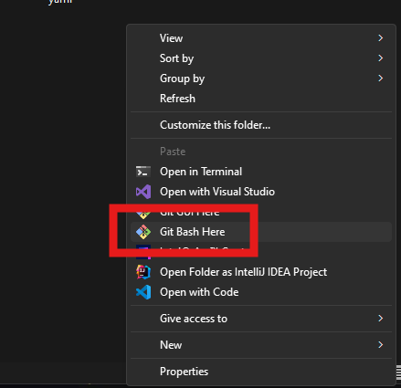

    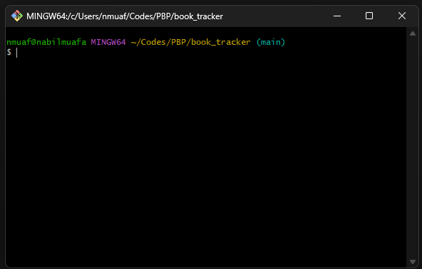

    Pada terminal tersebut, jalankan perintah `openssl base64 -in release-keystore.jks`. Perintah tersebut akan menghasilkan _base64 string_. Simpan _string_ yang dihasilkan untuk sementara waktu.

    Berikut contoh hasil dari menjalankan perintah tersebut.

    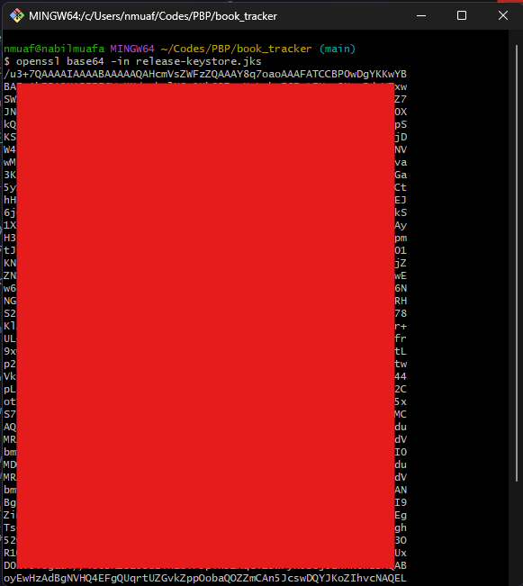

2. Buatlah _repository secrets_ pada repositori GitHub dengan spesifikasi sebagai berikut.

    i. `GH_TOKEN` berisi GitHub _(Personal Access) Token_ dari admin repositori untuk kepentingan _automated release_.

    Apabila kamu admin repositori, akses [halaman ini](https://github.com/settings/personal-access-tokens/new) untuk membuat sebuah _Personal Access Token_. Berikan _token_-mu nama yang unik. Pada bagian _Repository access_, pilih "_Only select repositories_" dan pilih repositori proyek Fluttermu. Buka bagian "_Repository permissions_", lalu berikan akses _Read-only_ ke setidaknya _permissions_ berikut:

    - Secrets

    Berikan akses _Read and write_ ke setidaknya _permissions_ berikut:

    - Actions
    - Workflows
    - Contents

    Salin _Personal Access Token_ yang dihasilkan dan simpan di lokasi lain, karena kamu tidak akan bisa melihat _token_ tersebut lagi melalui GitHub. Setelah itu, isi _repository secret_ `GH_TOKEN` dengan _Personal Access Token_ yang telah kamu salin.

    ii. `KEY_JKS` berisi `base64` _string_ dari _keystore file_ yang telah kamu buat sebelumnya.

    iii. `KEY_PASSWORD` berisi kata sandi yang kamu gunakan saat kamu membuat _keystore file_.

    Pada akhirnya, halaman _repository secrets_ kamu akan terlihat seperti ini.

    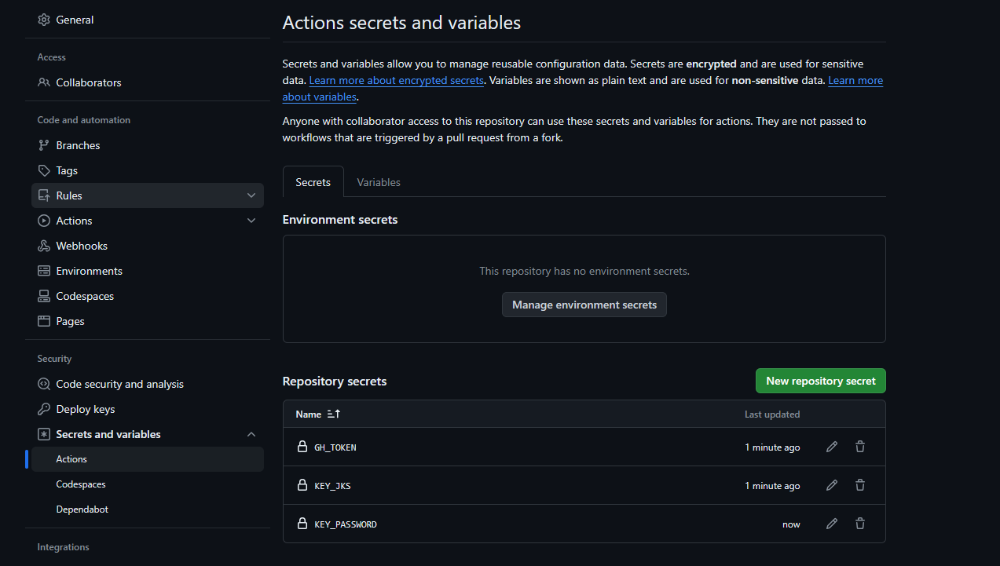

3. Jika belum ada, buatlah folder `.github/workflows` pada _root folder_ aplikasi.

4. Buatlah tiga berkas baru pada folder `.github/workflows` dengan spesifikasi berikut:

    > **Diasumsikan** branch `staging` digunakan untuk menampung kode aplikasi sebelum rilis dan branch `main` digunakan untuk perilisan kode aplikasi.

    i. `staging.yml`; berfungsi untuk mengecek apakah _codebase_ yang ada pada _branch_ `staging` bebas dari _error_ saat melakukan `flutter analyze`. Skrip ini hanya di-_trigger_ saat ada _commit_ pada _branch_ `staging`.

    ```yaml
    name: Staging

    # Controls when the workflow will run
    on:
     # Triggers the workflow on push or pull request events but only for the develop branch
      push:
        branches: [staging]
      pull_request:
        branches: [staging]

    # A workflow run is made up of one or more jobs that can run sequentially or in parallel
    jobs:
      # This workflow contains a single job called "build"
      build:
        name: Analyze
        # The type of runner that the job will run on
        runs-on: ubuntu-latest
        steps:
          - name: Checkout the code
            uses: actions/checkout@v4

          - name: Setup Java
            uses: actions/setup-java@v3
            with:
              distribution: "zulu"
              java-version: "11"

          - name: Setup Flutter
            uses: subosito/flutter-action@v2
            with:
              channel: "stable"

          - name: Get packages
            run: flutter pub get

          - name: Analyze
            run: flutter analyze
    ```

    ii. `pre-release.yml`; berfungsi untuk mengecek apakah proses _build_ aplikasi dapat berjalan tanpa _error_. Jika tidak ada _error_, file APK dapat diakses sebagai _artifact_. Skrip ini hanya di-_trigger_ saat ada _pull request_ dari _branch_ `staging` ke _branch_ `main`.

    ```yaml
    name: Pre-Release

    # Controls when the workflow will run
    on:
      # Triggers the workflow on pull request events but only for the main branch
      pull_request:
        branches: [main]

    # A workflow run is made up of one or more jobs that can run sequentially or in parallel
    jobs:
      # This workflow contains a single job called "Build and Pre-Release APK"
      releases:
        name: Build and Pre-Release APK
        # The type of runner that the job will run on
        runs-on: ubuntu-latest
        steps:
          - name: Checkout the code
            uses: actions/checkout@v4

          - name: Setup Java
            uses: actions/setup-java@v3
            with:
              distribution: "zulu"
              java-version: "11"

          - name: Setup Flutter
            uses: subosito/flutter-action@v2
            with:
              channel: "stable"

          - name: Get packages
            run: flutter pub get

          - name: Generate Java keystore
            env:
              KEY_JKS: ${{ secrets.KEY_JKS }}
            run: echo "$KEY_JKS" | base64 --decode > release-keystore.jks

          - name: Build APK
            env:
              KEY_PASSWORD: ${{ secrets.KEY_PASSWORD }}
            run: flutter build apk --split-per-abi

          - name: Pre-release APK by uploading it to Artifacts
            uses: actions/upload-artifact@v3
            with:
              name: APKS
              path: build/app/outputs/flutter-apk/*.apk
    ```

    iii. `release.yml`; berfungsi untuk melakukan proses _build_ aplikasi dan perilisan aplikasi sebagai _Releases_ pada repositori GitHub. Skrip ini hanya di-_trigger_ saat ada _commit_ pada _branch_ `main`.

    ```yaml
    # This is a basic workflow to help you get started with Actions
    name: Release

    # Controls when the workflow will run
    on:
     # Triggers the workflow on push events but only for the main branch
      push:
        branches: [main]

    # A workflow run is made up of one or more jobs that can run sequentially or in parallel
    jobs:
      # This workflow contains a single job called "Build and Release APK"
      releases:
        name: Build and Release APK
        # The type of runner that the job will run on
        runs-on: ubuntu-latest
        steps:
          - name: Checkout the code
            uses: actions/checkout@v4

          - name: Get version from pubspec.yaml
            id: version
            run: echo "::set-output name=version::$(grep "version:" pubspec.yaml | cut -c10-)"

          - name: Setup Java
            uses: actions/setup-java@v3
            with:
              distribution: "zulu"
              java-version: "11"

          - name: Setup Flutter
            uses: subosito/flutter-action@v2
            with:
              channel: "stable"

          - name: Get packages
            run: flutter pub get

          - name: Generate Java keystore
            env:
              KEY_JKS: ${{ secrets.KEY_JKS }}
            run: echo "$KEY_JKS" | base64 --decode > release-keystore.jks

          - name: Build APK
            env:
              KEY_PASSWORD: ${{ secrets.KEY_PASSWORD }}
            run: flutter build apk --split-per-abi

          - name: Get current date
            id: date
            run: echo "::set-output name=date::$(TZ='Asia/Jakarta' date +'%A %d-%m-%Y %T WIB')"

          - name: Release APK
            uses: ncipollo/release-action@v1
            with:
              allowUpdates: true
              artifacts: "build/app/outputs/flutter-apk/*.apk"
              body: "Published at ${{ steps.date.outputs.date }}"
              name: "v${{ steps.version.outputs.version }}"
              token: ${{ secrets.GH_TOKEN }}
              tag: ${{ steps.version.outputs.version }}
    ```

5. Simpan ketiga file tersebut dan _push_ ke repositori. Cek apakah aplikasi berhasil dibuat dan dirilis oleh GitHub Actions secara otomatis.

Apabila aplikasi kamu berhasil dibuat dan dirilis otomatis, maka selamat! Sampai sini, kita sudah menyelesaikan _workflow_ pada GitHub. Selanjutnya, kita akan membuat skrip baru untuk _build_ pada App Center dan mengonfigurasi aplikasi secara lebih lanjut pada situs web App Center.

## Tutorial: Penambahan Skrip CI/CD untuk App Center

Pada bagian ini, kita akan menambahkan skrip _continuous integration_ dan _continuous delivery_ pada repositori aplikasi Flutter agar App Center dapat membangun dan menghasilkan berkas APK aplikasi secara otomatis.

1. Buka folder `/android/app`.

2. Buatlah file baru dengan nama `appcenter-post-clone.sh` dan isi file tersebut dengan kode berikut.

    ```bash
    #!/usr/bin/env bash
    # Place this script in project/android/app/

    cd ..

    # fail if any command fails
    set -e
    # debug log
    set -x

    cd ..
    git clone -b beta https://github.com/flutter/flutter.git
    export PATH=`pwd`/flutter/bin:$PATH

    flutter channel stable
    flutter doctor

    echo "Installed flutter to `pwd`/flutter"

    # export keystore for release
    echo "$KEY_JKS" | base64 --decode > release-keystore.jks

    # build APK
    # if you get "Execution failed for task ':app:lintVitalRelease'." error, uncomment next two lines
    # flutter build apk --debug
    # flutter build apk --profile
    flutter build apk --release

    # copy the APK where AppCenter will find it
    mkdir -p android/app/build/outputs/apk/; mv build/app/outputs/apk/release/app-release.apk $_
    ```

3. Buka file `/android/.gitignore` dan ubahlah file tersebut menjadi berikut. Hal ini dilakukan agar App Center dapat mendeteksi aplikasi sebagai aplikasi Android.

    ```yaml
    # add comment for app center
    # gradle-wrapper.jar
    # /gradlew
    # /gradlew.bat
    /.gradle
    /captures/
    /local.properties
    GeneratedPluginRegistrant.java

    # Remember to never publicly share your keystore.
    # See https://flutter.dev/docs/deployment/android#reference-the-keystore-from-the-app
    key.properties
    **/*.keystore
    **/*.jks
    ```

4. Simpan file tersebut dan _push_ ke repositori. Pastikan skrip ini dan `.gitignore` yang baru telah ter-_push_ sampai ke _branch_ `main`.

Setelah selesai membuat skrip, kita akan mengonfigurasi aplikasi pada App Center agar dapat dibuat dan dirilis secara otomatis.

## Tutorial: Konfigurasi Lanjutan pada App Center

1. Buka situs web App Center dan buka proyek aplikasi.

    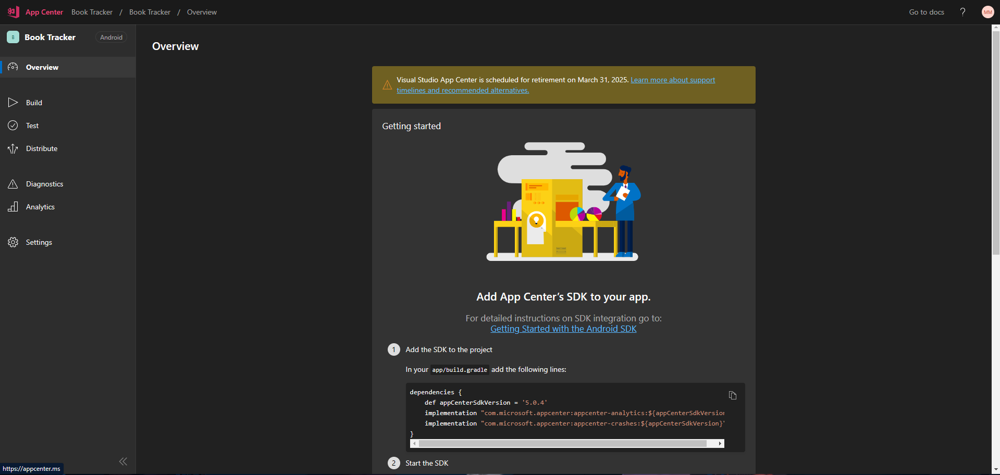

2. Buka menu `Build` dan pilih GitHub sebagai servis penyedia repositori aplikasi. Pilihlah repositori aplikasi proyek kelompok kamu.

    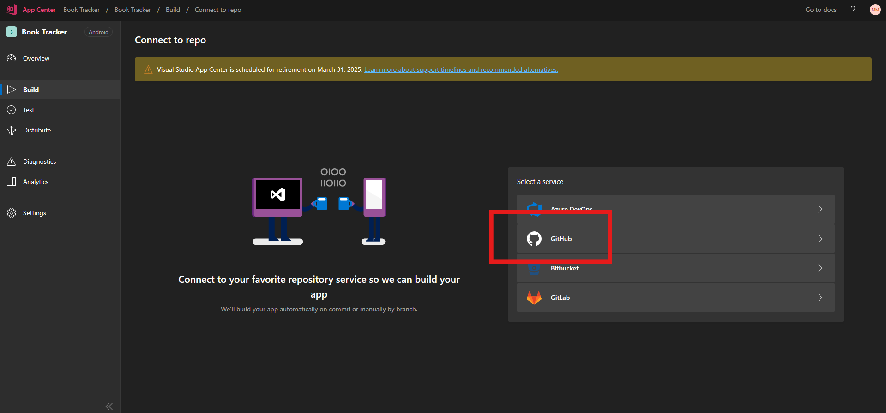

3. Buka branch utama kamu (`main` atau `master`, silakan disesuaikan) dan klik tombol `Configure`.

    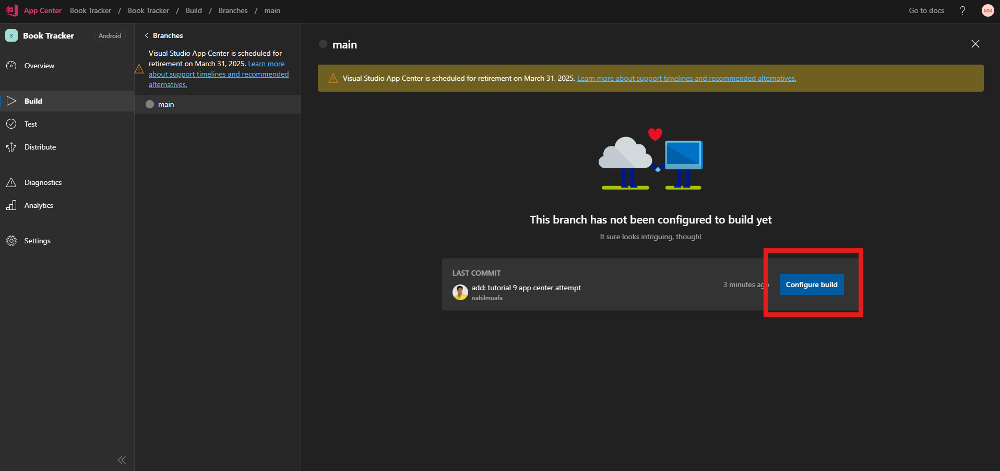

4. Ikuti pengaturan berikut:

    - Nyalakan _Environment variables_
    - Isi dengan _name_ dan _value_ berikut:
        - `JAVA_HOME`: `$(JAVA_HOME_11_X64)`
        - `KEY_JKS`: `<base64 dari keystoremu>`
        - `KEY_PASSWORD`: `<password dari keystoremu>`
    - Centang `Sign builds`, dan didalamnya centang `My Gradle settings are entirely set to handle signing automatically`.
    - Centang `Distribute builds` dan _radio button_ `Groups`. Centang grup `Contributors` dan `Public` pada _dropdown menu_ `Select destination`.
    - Centang `Build status badge`.

    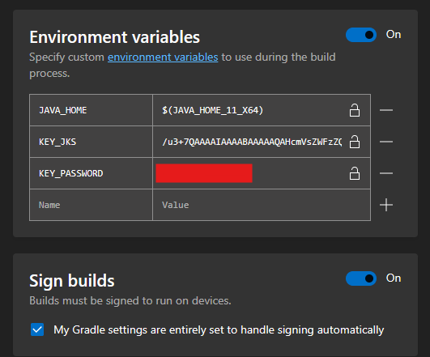
    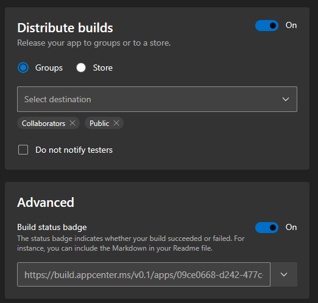

    Catatan:

    - Jangan lupa untuk mengganti `KEY_JKS` dan `KEY_PASSWORD` dengan _value_ yang sebenarnya.
    - Jangan lupa untuk membuat grup `Public` untuk distribusi aplikasi secara publik.
    - Salinlah tautan _build badge_ dengan format `Markdown` dan tempelkan ke `README.md` repositorimu.

    

    

5. Klik tombol `Save & Build` untuk menyimpan konfigurasi dan memulai proses _build_ perdana.

    Kamu dapat mengecek tautan publik dari publikasi aplikasi pada App Center melalui menu _Distribute_ -> _Groups_ -> _Public_. Kamu juga dapat menyalin tautan publik dari publikasi aplikasi.

    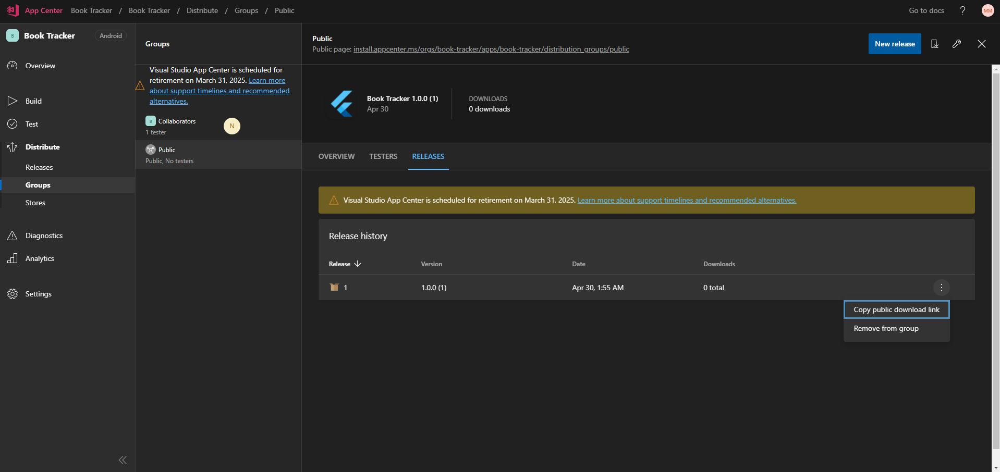

6. Salinlah tautan publik dari publikasi aplikasi dan tempelkan ke `README.md`

## Akhir Kata

Selamat, kamu telah berhasil untuk men-_deploy_ aplikasi Flutter kamu ke App Center. Kamu dapat mengecek aplikasi yang telah kamu _deploy_ dengan mengunduh berkas APK dari App Center dan menginstalnya pada ponsel pintar kamu.

Dan kita, sudah resmi, menamatkan tutorial PBP Semester Genap 2023/2024! Terima kasih telah mengikuti dan mengerjakan semua tutorial PBP Semester Genap 2023/2024. Tim pengajar ingin mengucapkan apresiasi kepada semua mahasiswa yang telah berpartisipasi dan berkontribusi dalam mata kuliah ini. Tim pengajar melihat usaha dan dedikasi yang telah kalian tunjukkan dalam menghadapi tantangan pengembangan aplikasi multiplatform pada mata kuliah ini.

Selama proses lab dan tugas, kita telah menggali konsep dan prinsip dasar yang mendasari pengembangan aplikasi web dan _mobile_ menggunakan Django dan Flutter. Kalian telah mempelajari tentang arsitektur, fitur, dan alat yang dapat membantu dalam membangun aplikasi yang tangguh dan responsif di kedua platform ini.

Tim pengajar berharap lab dan tugas yang diberikan dapat memberikan pemahaman yang lebih mendalam tentang potensi dan tantangan dalam pengembangan aplikasi multiplatform serta memberikan kalian keterampilan yang berguna dan dapat diterapkan dalam karir kalian sebagai pengembang perangkat lunak.

Namun, pembelajaran tidak berhenti di sini. Dunia pengembangan terus berkembang dengan cepat, dan penting untuk tetap mengikuti perkembangan terbaru dalam industri ini. Tim pengajar mendorong kalian untuk terus belajar dan menjaga keterampilan kalian tetap relevan dengan membaca referensi lainnya, mengikuti kursus lanjutan, dan mengambil bagian dalam proyek-proyek nyata.

Akhir kata, ingatlah bahwa pengembangan aplikasi multiplatform adalah bidang yang menarik dan penuh potensi. Teruslah eksplorasi dan berinovasi, dan tim pengajar yakin kalian memiliki masa depan yang cerah sebagai pengembang perangkat lunak. Terima kasih dan semoga sukses dalam perjalanan kalian!

Do zobaczenia i powodzenia!

## Kontributor

- Muhammad Nabil Mu'afa

## Credits

Tutorial ini dikembangkan berdasarkan [entri blog](https://determinedguy.github.io/cecoret/flutter-at-app-center/) yang ditulis oleh [Muhammad Athallah](https://github.com/determinedguy/). Segala tutorial serta instruksi yang dicantumkan pada repositori ini dirancang sedemikian rupa sehingga mahasiswa yang sedang mengambil mata kuliah Pemrograman Berbasis Platform dapat menyelesaikan tutorial saat sesi lab berlangsung.
